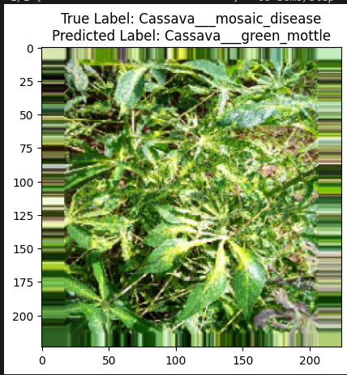

# CASSAVA LEAF DISEASE CLASSIFICATION

## GOAL
Developing various computer vision models to classify leaf diseases.

## DATASET
https://www.kaggle.com/datasets/nirmalsankalana/cassava-leaf-disease-classification

## MODELS USED
- CNN
- VGG16
- Inception
- ResNet50
- AlexNet

## LIBRARIES
- Pandas
- Numpy
- TensorFlow
- OS,Shutil
- Matplotlib
- Scikit-Learn

## IMPLEMENTATION
1. Load dataset (10,000 entries, 3 columns).
2. Clean text data (handle null values, spaces, capitalization).
3. Use 4 sentiment classes: Positive, Neutral, Negative, Very Negative.
4. Implement tokenization for sequence conversion.
5. Train models with various algorithms.

## Models and Accuracies

| Model             | Accuracy   | 
| ----------------- |:----------:| 
| Roberta           | 0.79       |                    
| LSTM              | 0.72       |                    
| Neural Network    | 0.67       |                    
| Logistic Regression| 0.71      |                    

**VISUALISATION**

**CONCLUSION**

Inception Model has best accuracy out of all models

**NAME**

Keshav Arora
