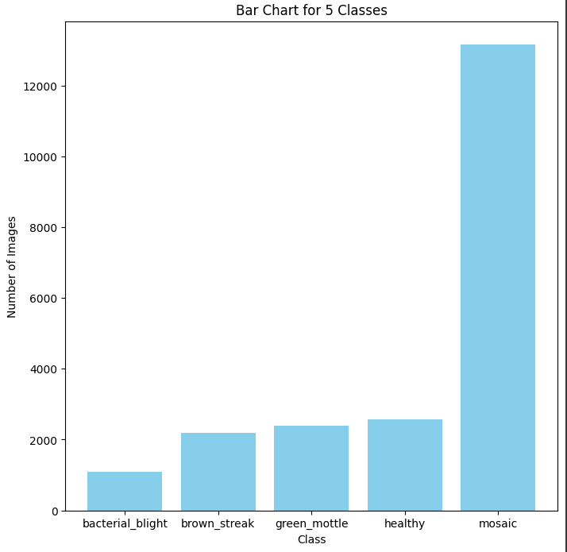
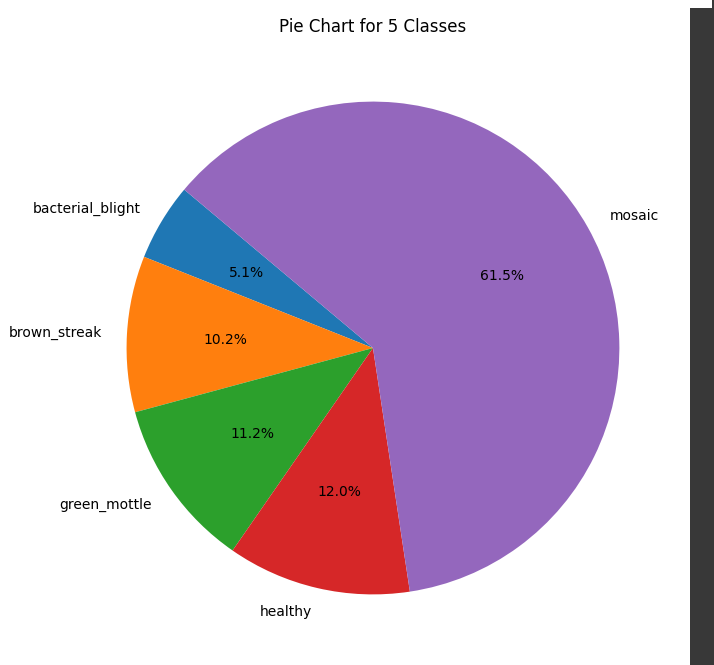

# CASSAVA LEAF DISEASE CLASSIFICATION

## GOAL
Developing various computer vision models to classify leaf diseases.

## DATASET
https://www.kaggle.com/datasets/nirmalsankalana/cassava-leaf-disease-classification

## MODELS USED
- CNN
- VGG16
- Inception
- ResNet50
- AlexNet

## LIBRARIES
- Pandas
- Numpy
- TensorFlow
- OS,Shutil
- Matplotlib
- Scikit-Learn

## IMPLEMENTATION
1. Load dataset (21,000 entries and 5 columns)
2. Implemented Deep learning models.
3. Applied data augmentation and undersampling of dataset separately for comparison.
4. Alexnet and undersampled models werent trained fully due to computational and time constraints but their expected accuracy is mapped logically.

## Models and Accuracies

| Model             | Accuracy   | Validation Loss |
| ----------------- |:----------:|:---------------:|
| CNN               | 0.70       |     0.808       |
| VGG16             | 0.61       |     0.911       |
| CNN(Data Aug)     | 0.66       |     0.865       |
| ResNet            | 0.61       |     1.099       |
| InceptionV3       | 0.69       |     0.833       |
| AlexNet           | ~0.62      |     ~1.000      |
| CNN(Undersampled) | ~0.5       |     ~1.00       |
             

**VISUALISATION**

EDA Analysis as Bar Graph(Before Undersampling)

EDA Analysis as Pie Chart(Before Undersampling)

After Effective Undersampling from 17k to 2k ish in last class of mosaic_disease.

Example of Mismatch for demonstration purpose.

**CONCLUSION**

CNN Model is the best out of all models(accuracy and validation loss).In this database undersampling and data augmentation were found to not have any significant impact.

**NAME**

Keshav Arora
