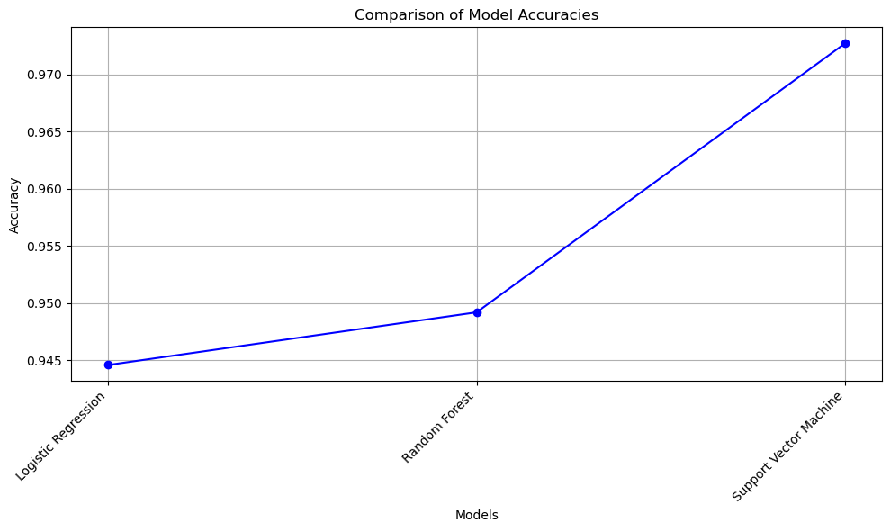

  

**F1 Visa Experiences**

  

**GOAL**

  
Finding out if the review is positive, negative or neutral.
  

**DATASET**

  

https://www.kaggle.com/datasets/adiamaan/f1-visa-experiences

  

  

**WORK DONE**

* Analyzed the data and found insights and plotted graphs accordingly etc.
* Preprocessed the data to make it fit for training for ML models.
* Next trained model with algorithms with default parameters:
	* Logistic Regression
	* Linear SVM
	* Random Forest

* In this, Support Vector Machine(SVM) performed the best with 97.27% accuracy. (Refer : `visa_experience.ipynb`)
  

**MODELS USED**

1. Logistic Regression : Logistic regression is easier to implement, interpret, and very efficient to train. It is **very fast at classifying unknown records**.
2. Linear SVM : SVM performs well on classification problems when size of dataset is not too large.
3. Random Forest : It **provides higher accuracy through cross validation**. Random forest classifier will handle the missing values and maintain the accuracy of a large proportion of data. If there are more trees, it won't allow over-fitting trees in the model.

**LIBRARIES NEEDED**

* Numpy
* Pandas
* Matplotlib
* scikit-learn
* nltk
  
  

**PLOTS**

**CONCLUSION**

  

We analyse the data, preprocess and visualize the features. We then investigated two predictive models. The data was split into two parts, a train set and a test set.

We started with Logistic Regression, Random Forest Classifier and SVM and SVM had the highest accuracy followed by Random Forest Classifier.

  

**CONTRIBUTION BY**

*Churnika S Mundas*

  
  
